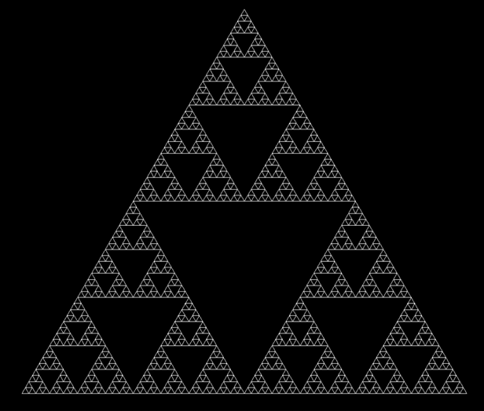
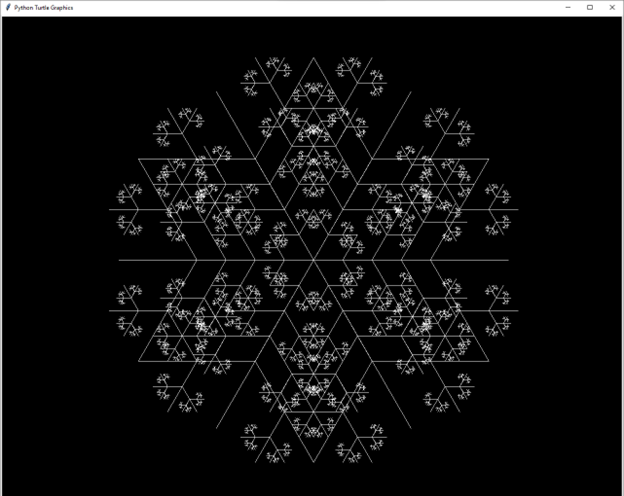
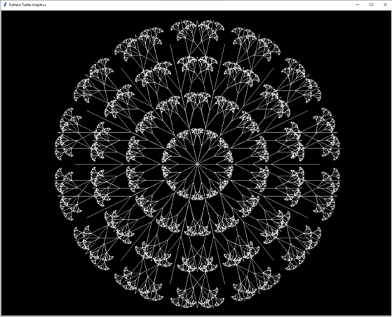
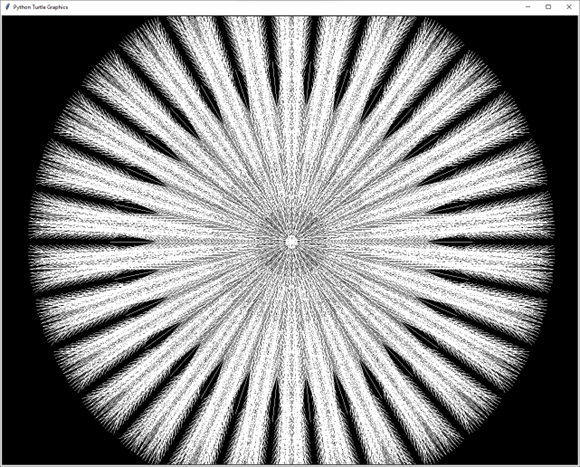
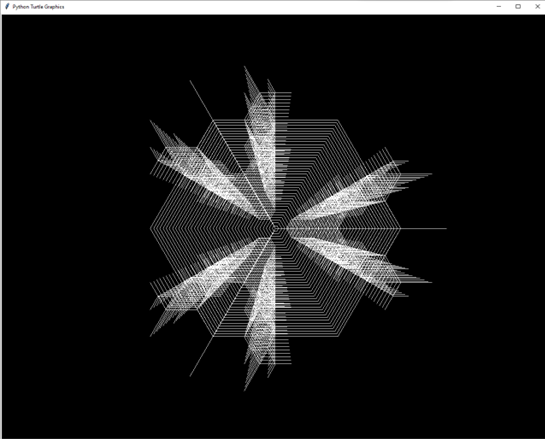
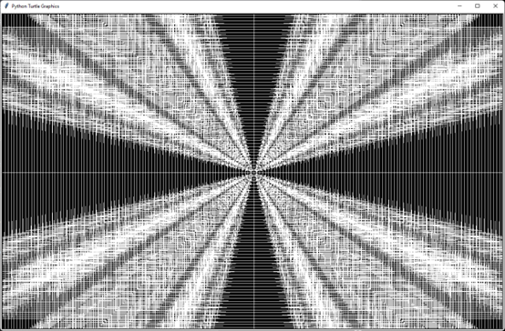
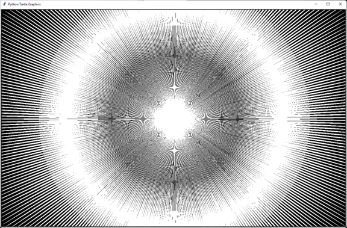

# In this section I am working on fractals.

A fractal is a geometric shape containing detailed structure at arbitrarily small scales, usually having a fractal dimension strictly exceeding the topological dimension.

## The serpinsky triangle

/tiangle.py/

## Snowflake

/Snow.py/

